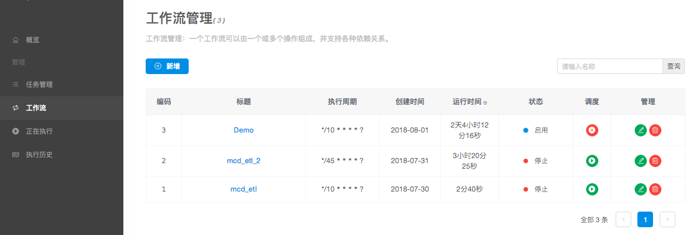
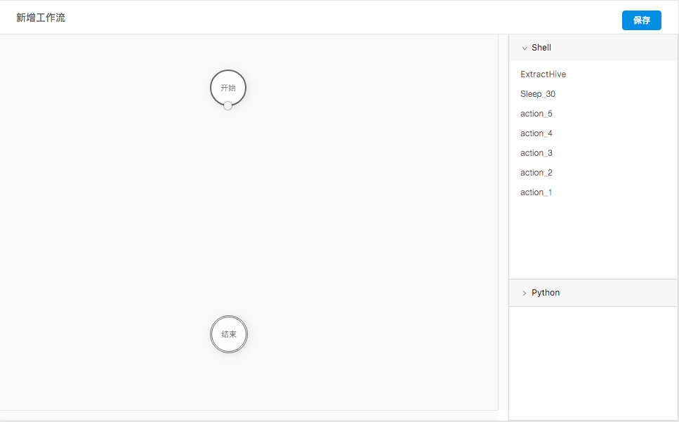
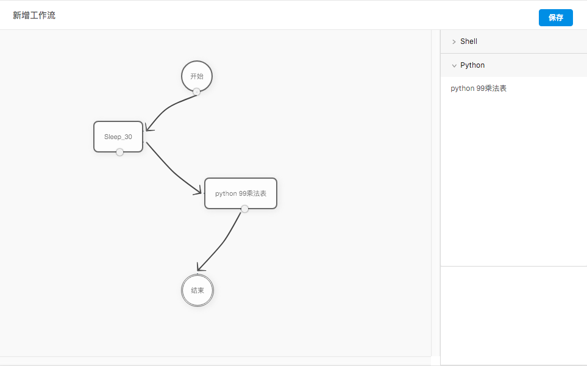
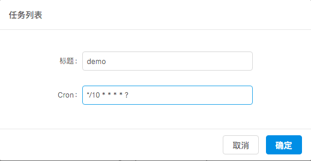

#### 调度

##### 启动工作流

如下图所示：在左边的导航栏选择**工作流**，然后点击右边页面**新增**

**添加动作到工作流**

工作流以**开始**动作作为开始执行的起点，**结束**动作作为执行结束的标记。从右边的动作列表中选择要添加的动作。

选择右边的动作，左键按住拖到工作流画布里。如果要关联动作，可以左击按住拖到另一个动作上，尖头方向表征了执行的依赖关系。如下图：执行顺序为：**开始 -> Sleep_30 -> python 99乘法表 ->结束**

添加动作结束后，即可点击**保存**按钮，弹出如下的对画框：

在弹出对话框中，需要输入工作流的标题以及它的执行周期。对于执行周期的格式是cron表达式，一个cron表达式有至少6个（也可能是7个）由空格分隔的时间元素。从左至右，这些元素的定义如下：

> 秒（0–59）
>
> 分钟（0–59）
>
> 小时（0–23）
>
> 月份中的日期（1–31）
>
> 月份（1–12或JAN–DEC）
>
> 星期中的日期（1–7或SUN–SAT）
>
> 年份（1970–2099）

填写完cron表达式后，即可点击**确定**按钮，保存工作流。

##### 编辑工作流

工作流定义好，可以通过点击**编辑**按钮重新编辑工作流。编辑完成后点击**保存**按钮即可。

**删除工作流**

工作流定义好，可以通过点击**删除**按钮移除工作流。